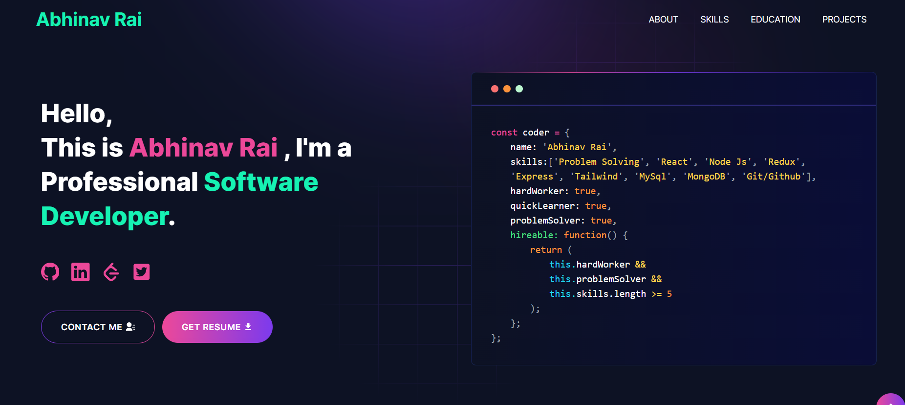

# Portfolio Website
---

## Description

Welcome to my personal portfolio website! As a passionate and aspiring full stack developer, this site showcases my skills and projects. It is designed to provide a comprehensive view of my journey, highlighting my enthusiasm for web application development. Explore my work and see how I am eager to learn, grow, and contribute to the tech industry.

---
## Demo :movie_camera:



---

# Sections :bookmark:

- HERO SECTION
- ABOUT ME
- SKILLS
- PROJECTS
- EDUCATION
- CONTACTS

---

## Setup Instructions

1. Clone the repository:
    ```bash
       https://github.com/AbhinavRai2004/MyPortfolio.git
    ```
2. Navigate to the project directory:
    ```bash
    cd MyPortfolio
    ```
3. If applicable, install dependencies:
    ```bash
    npm install
    ```
4. Start the development server:
    ```bash
    npm run dev
    ```
5. Open [http://localhost:3000](http://localhost:3000) with your browser to see the result.

---
## Usage

Goto [emailjs.com](https://www.emailjs.com/) and create a new account for the mail sending. In free trial you will get 200 mail per month. After setup `emailjs` account, Please create a new `.env` file from `.env.example` file.

Eg:

```env
NEXT_PUBLIC_EMAILJS_SERVICE_ID =
NEXT_PUBLIC_EMAILJS_TEMPLATE_ID =
NEXT_PUBLIC_EMAILJS_PUBLIC_KEY =
NEXT_PUBLIC_GTM = # For site analytics
NEXT_PUBLIC_APP_URL = "http://127.0.0.1:3000"
NEXT_PUBLIC_RECAPTCHA_SECRET_KEY = # For captcha verification on contact form
NEXT_PUBLIC_RECAPTCHA_SITE_KEY =
```

### Then, Customize data in the `utils/data` [folder].

Eg:

```javascript
export const personalData = {
  name: "Abhinav Rai",
  profile: '/profile.png',
  description: "My name is Abhinav Rai, and I am a dedicated and enthusiastic programmer. I am a quick learner with a strong self-learning attitude, always eager to explore and master new technologies. I have a passion for problem-solving and a deep interest in all aspects of web application development. My core skill lies in ReactJs, NodeJs, JavaScript, and I enjoy leveraging it to create open and accessible web solutions. I am open to any job opportunities that align with my skills and interests.",
  email: 'raiabhinav.in@gmail.com',
  phone: '+91-9335783068',
  address: 'Assi, Varanasi, Uttar Pradesh, 221005',
  github: 'https://github.com/AbhinavRai2004',
  linkedIn: 'https://www.linkedin.com/in/abhinav2004',
  twitter: 'https://twitter.com/AbhinavRai48039',
  stackOverflow: 'https://stackoverflow.com/users/22012099/abhinav-rai',
  leetcode: "https://leetcode.com/u/user400AB/",
  resume: "https://drive.google.com/file/d/14FeRjlTgYUw7qeyxhf7X8zgPbC1Tf-Uz/view?usp=drive_link"
}
```
---


## Packages Used :package:

| Used Package List  |
| :----------------: |
|        next        |
|  @emailjs/browser  |
|    lottie-react    |
| react-fast-marquee |
|    react-icons     |
|   react-toastify   |
|        sass        |
|    tailwindcss     |

---
## Contact

Feel free to reach out to me via [email](mailto:raiabhinav.in@example.com) or connect with me on [LinkedIn](https://www.linkedin.com/in/abhinav2004).

